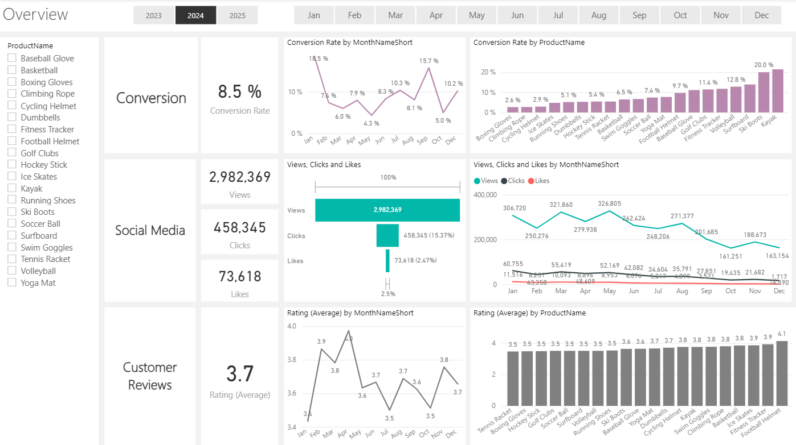

# 📊 Marketing Analytics — ShopEasy Business Case


---

## 🧩 Problem Statement

ShopEasy, an online retail business, faced **declining customer engagement and conversion rates** despite increased marketing investment. The business needed a comprehensive data-driven analysis to understand campaign effectiveness, customer sentiment, and user journey behavior — and to identify concrete opportunities for improvement.

> *"How can ShopEasy leverage multi-source marketing data to reverse declining conversions, re-engage customers, and optimize marketing ROI?"*

The raw data was scattered across five tables — customers, geography, products, customer journey, engagement, and reviews — with inconsistent formatting, duplicate entries, missing values, and unstructured text feedback. Before any insight could be drawn, the data had to be cleaned, standardized, and enriched.

---

## 🛠️ My Solving Process

I treated this like a real pipeline rather than a one-off analysis: clean the raw data, enrich it with sentiment, build a dashboard on top of it, then read across everything to land on recommendations.

**Step 1 — Cleaning the data in SQL Server.** The raw tables were messy in the way real business data usually is: customer records with no location context, products with no price tiering, duplicate journey entries, missing durations, and inconsistent text formatting. I worked through this table by table — joining `customers` to `geography` so every record had a country and city, then bucketing products into Low/Medium/High price tiers with a simple CASE statement. The customer journey table needed the most work: I used a CTE with `ROW_NUMBER()` to catch and drop duplicate entries, then filled in missing `Duration` values with `COALESCE` against each date's average rather than leaving gaps. Reviews just needed whitespace cleanup, while the engagement data required splitting a combined `ViewsClicksCombined` column into proper `Views` and `Clicks` fields, standardizing content type labels, reformatting dates, and dropping newsletter rows that weren't relevant to the analysis.

**Step 2 — Scoring sentiment in Python.** Once the reviews were clean, I pulled them into Python via `pyodbc` and ran them through NLTK's VADER sentiment analyzer, which scores each review from –1.0 (very negative) to +1.0 (very positive). Rather than relying on that score alone, I combined it with each review's star rating to sort every review into one of five categories — Positive, Negative, Mixed Positive, Mixed Negative, or Neutral — since a 5-star review with lukewarm text and a 1-star review with sarcastic praise both need to land in the right bucket. I also grouped the raw scores into four ranges to make later filtering in Power BI easier, then exported everything to a clean CSV.

**Step 3 — Building the dashboard in Power BI.** With clean, sentiment-tagged data ready to go, I built a custom DAX calendar table covering 2023–2025 to power all the time-based comparisons, then structured the dashboard around three connected views: an overall summary, a conversion funnel breakdown, and a social media/engagement view — each filterable by year, month, and product so patterns are easy to isolate.

**Step 4 — Connecting the dots.** The real insight came from reading the three views together instead of separately. For example, the sharp drop in views after August lined up with weaker conversion months later in the year, and the negative-sentiment reviews clustered around themes (price complaints, "average" experiences) that matched up with specific underperforming products. That cross-referencing is what shaped the recommendations below, rather than treating each dashboard tab as its own isolated finding.

---

## 💡 Key Findings

### Overview
The overview ties conversion, social media, and review KPIs together at a glance. 2024 closed with an **8.5% overall conversion rate**, **2.98M views**, **458K clicks (15.37% CTR)**, and an **average rating of 3.7**.



- 📉 **Lowest Conversion Month:** May at **4.3%** — no standout product performance
- 📈 **Best Conversion Month:** December at **10.2%** — strong end-of-year rebound
- 👁️ **Engagement Decline:** Views peaked in **Feb & July**, then declined sharply from August onward

### Conversion Details
Drilling into the funnel (View → Click → Drop-off → Purchase) shows where customers fall off, and which products convert best.


- **Kayak** leads product conversion at **21.4%**, followed by **Ski Boots (20.0%)** and **Surfboard (13.9%)**
- Conversion by month is volatile month-to-month per product, suggesting seasonal/promotional effects rather than steady demand

### Social Media Details
Views, clicks, and likes broken down by month, product, and content type (Blog, Social Media, Video).


- 🖱️ **Click-Through Rate:** 15.37% — engaged users still interact effectively once they click through
- 🔍 **Low Interaction Rate:** Likes sit at just **2.47%** of views — a wide gap between passive viewing and active engagement
- Views trend down steadily after July, across almost all content types

### Customer Review Details
Rating distribution, sentiment breakdown, and a bubble chart correlating average rating with review volume.


- ⭐ **Top Ratings:** 140 reviews at 4★ and 135 reviews at 5★ — a majority-positive base
- 😊 **Positive Sentiment:** 275 reviews classified Positive via VADER
- 😠 **Negative Sentiment:** 82 reviews flagged Negative, clustered around themes like pricing and "average experience"

---

## 📌 Business Recommendations

**1. Address the May Conversion Dip**
May showed the lowest conversion rate at 4.3% with no strong product performers. Introduce targeted promotions, time-limited offers, or improved landing pages in April–May to lift this trough.

**2. Rebuild Engagement After August**
Views peaked in February and July then declined sharply. Schedule high-impact content campaigns and seasonal pushes for Q3–Q4 to sustain audience engagement through year-end.

**3. Improve Content Click-Through Quality**
Despite a 15.37% CTR among engaged users, absolute click and like volumes remain low relative to views. A/B test stronger calls-to-action, interactive content formats, and personalized recommendations to convert passive viewers into active engagers.

**4. Act on Negative Sentiment Reviews**
82 reviews classified as Negative represent a concentrated opportunity — common themes (pricing concerns, average experience) should be used to guide product positioning, customer service scripts, and post-purchase follow-up sequences.

**5. Replicate December's Success Earlier in the Year**
Conversion rebounded strongly to 10.2% in December. Analyze what drove this (promotions, product mix, campaigns) and apply those levers to under-performing months like May and October.

**6. Leverage Positive Reviews as Social Proof**
275 Positive reviews and strong 4–5 star ratings are an underutilized asset. Incorporate review highlights into campaign creatives and product pages to reinforce trust and conversion signals.

---

## 🗂️ Project Structure

```
📁 marketing-analytics/
│
├── 📊 01_business_case_and_kpis.pptx           # Business case & KPI definition
├── 🗄️ 02_sql_dim_customers.sql                  # Customer + geography JOIN query
├── 🗄️ 03_sql_dim_products.sql                   # Product price categorization
├── 🗄️ 04_sql_fact_customer_journey.sql          # Journey deduplication & cleaning
├── 🗄️ 05_sql_fact_customer_reviews.sql          # Reviews whitespace cleaning
├── 🗄️ 06_sql_fact_engagement_data.sql           # Engagement data normalization
├── 🐍 07_python_sentiment_analysis.py           # VADER sentiment analysis pipeline
├── 📄 08_output_reviews_with_sentiment.csv      # Enriched reviews output
├── 📊 10_powerbi_dashboard.pbix                 # Interactive Power BI dashboard
├── 📝 09_dax_calendar_table.txt                 # Custom DAX calendar table
├── 📊 11_final_presentation.pptx                # Final findings presentation
└── 🖼️ images/                                   # Dashboard screenshots
    ├── 1_png.png                                # Overview
    ├── 2_png.png                                # Conversion Details
    ├── 3_png.png                                # Social Media Details
    └── 4_png.png                                # Customer Review Details
```

---

## 🔧 Tools & Technologies

| Layer | Tool |
|---|---|
| Data Cleaning & Sentiment Analysis | Python, Pandas, NLTK (VADER) |
| Database & SQL Transformations | SQL Server (T-SQL) |
| Visualization & Reporting | Power BI, DAX |
| Presentation | PowerPoint |

---

## 📁 Dataset Overview

The project spans four core fact/dimension tables sourced from `PortfolioProject_MarketingAnalytics`:

| Table | Description |
|---|---|
| `dbo.customers` + `dbo.geography` | Customer demographics enriched with country/city |
| `dbo.products` | Product catalog with price-based category segmentation |
| `dbo.customer_journey` | Multi-stage funnel interactions (Awareness → Purchase) |
| `dbo.customer_reviews` | Star ratings + free-text review data |
| `dbo.engagement_data` | Views, clicks, likes by content type and campaign |

---

## 📋 KPIs Tracked

- **Conversion Rate** — % of website visitors who complete a purchase
- **Customer Engagement Rate** — Interactions with marketing content (clicks, likes, comments)
- **Average Order Value (AOV)** — Average spend per transaction
- **Customer Feedback Score** — Average rating from customer reviews

---

## 👤 Author

**Hamza Anjum**
Data Analyst | Python · SQL · Power BI

<p>
  <a href="https://www.linkedin.com/in/hamza-anjum-459bba320/">
    
  </a>
  &nbsp;
  <a href="https://github.com/Hamza-227">
    
  </a>
  &nbsp;
  <a href="mailto:hamzaanjum664@gmail.com">
    
  </a>
</p>

---

*This project was completed as part of a marketing analytics initiative using Python, SQL Server, and Power BI to deliver data-driven insights for ShopEasy's marketing optimization.*
