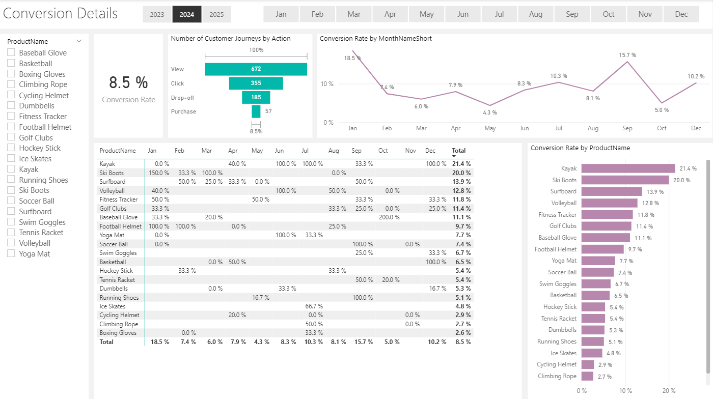
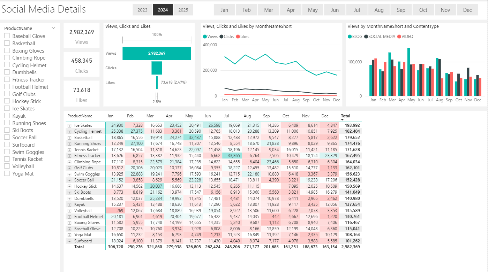
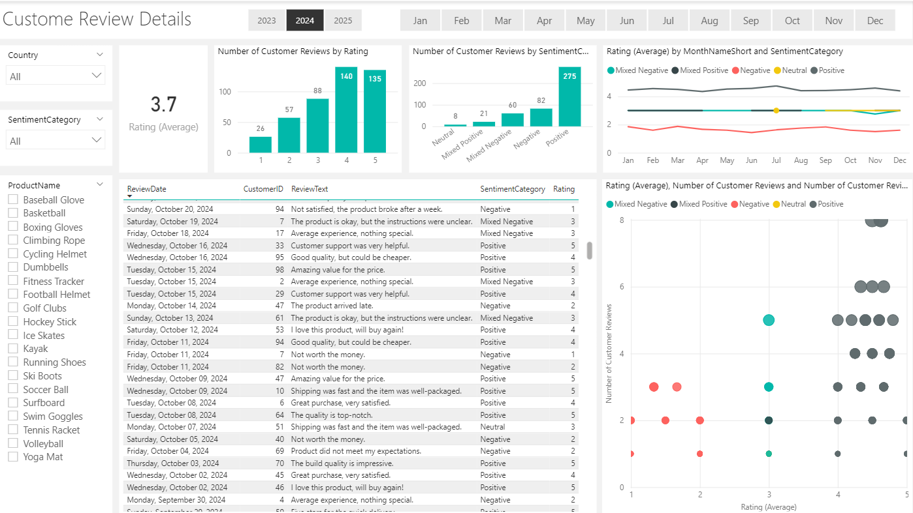

# 📊 Marketing Analytics — ShopEasy Business Case


---

## 🧩 Problem Statement

ShopEasy, an online retail business, faced **declining customer engagement and conversion rates** despite increased marketing investment. The business needed a comprehensive data-driven analysis to understand campaign effectiveness, customer sentiment, and user journey behavior — and to identify concrete opportunities for improvement.

> *"How can ShopEasy leverage multi-source marketing data to reverse declining conversions, re-engage customers, and optimize marketing ROI?"*

---

## 📊 Power BI Dashboard Preview

### Overview
High-level view of Conversion, Social Media, and Customer Review KPIs across the year, with monthly and product-level breakdowns.



### Conversion Details
Drill-down into the customer journey funnel (View → Click → Drop-off → Purchase) and conversion rate by product and month.


### Social Media Details
Views, clicks, and likes broken down by month, product, and content type (Blog, Social Media, Video).



### Customer Review Details
Rating distribution, sentiment category breakdown, and a bubble chart correlating rating average with review volume.



---

## 💡 Key Findings

| Insight | Finding |
|---|---|
| 📉 Lowest Conversion Month | **May at 4.3%** — no standout product performance |
| 📈 Best Conversion Month | **December at 10.2%** — strong end-of-year rebound |
| 👁️ Engagement Decline | Views peaked in **Feb & July**, declined sharply from August onward |
| 🖱️ Click-Through Rate | **15.37%** — engaged users still interacting effectively |
| ⭐ Top Customer Ratings | **140 reviews at 4★** and **135 reviews at 5★** — majority positive |
| 😊 Positive Sentiment | **275 reviews** classified as Positive via VADER sentiment analysis |
| 😠 Negative Sentiment | **82 reviews** flagged Negative — key areas for CX improvement |
| 🔍 Low Interaction Rate | Clicks and likes consistently low vs. views — content engagement gap identified |

---

## 🗂️ Project Structure

```
📁 marketing-analytics/
│
├── 📊 01_business_case_and_kpis.pptx           # Business case & KPI definition
├── 🗄️ 02_sql_dim_customers.sql                  # Customer + geography JOIN query
├── 🗄️ 03_sql_dim_products.sql                   # Product price categorization
├── 🗄️ 04_sql_fact_customer_journey.sql          # Journey deduplication & cleaning
├── 🗄️ 05_sql_fact_customer_reviews.sql          # Reviews whitespace cleaning
├── 🗄️ 06_sql_fact_engagement_data.sql           # Engagement data normalization
├── 🐍 07_python_sentiment_analysis.py           # VADER sentiment analysis pipeline
├── 📄 08_output_reviews_with_sentiment.csv      # Enriched reviews output
├── 📊 10_powerbi_dashboard.pbix                 # Interactive Power BI dashboard
├── 📝 09_dax_calendar_table.txt                 # Custom DAX calendar table
├── 📊 11_final_presentation.pptx                # Final findings presentation
└── 🖼️ images/                                   # Dashboard screenshots
    ├── 1_png.png                                # Overview
    ├── 2_png.png                                # Conversion Details
    ├── 3_png.png                                # Social Media Details
    └── 4_png.png                                # Customer Review Details
```

---

## 🔧 Tools & Technologies

| Layer | Tool |
|---|---|
| Data Cleaning & Sentiment Analysis | Python, Pandas, NLTK (VADER) |
| Database & SQL Transformations | SQL Server (T-SQL) |
| Visualization & Reporting | Power BI, DAX |
| Presentation | PowerPoint |

---

## 📁 Dataset Overview

The project spans four core fact/dimension tables sourced from `PortfolioProject_MarketingAnalytics`:

| Table | Description |
|---|---|
| `dbo.customers` + `dbo.geography` | Customer demographics enriched with country/city |
| `dbo.products` | Product catalog with price-based category segmentation |
| `dbo.customer_journey` | Multi-stage funnel interactions (Awareness → Purchase) |
| `dbo.customer_reviews` | Star ratings + free-text review data |
| `dbo.engagement_data` | Views, clicks, likes by content type and campaign |

---

## 📋 KPIs Tracked

- **Conversion Rate** — % of website visitors who complete a purchase
- **Customer Engagement Rate** — Interactions with marketing content (clicks, likes, comments)
- **Average Order Value (AOV)** — Average spend per transaction
- **Customer Feedback Score** — Average rating from customer reviews

---

## 🗄️ SQL — Data Cleaning & Transformation

Five SQL scripts handle all upstream data preparation:

**`02_sql_dim_customers.sql`** — LEFT JOIN between `customers` and `geography` tables to enrich records with `Country` and `City` fields.

**`03_sql_dim_products.sql`** — CASE statement to segment products into `Low` (<$50), `Medium` ($50–$200), and `High` (>$200) price categories.

**`04_sql_fact_customer_journey.sql`** — CTE with `ROW_NUMBER()` to detect and remove duplicate journey entries; `COALESCE` to impute missing `Duration` values using per-date averages; `UPPER(Stage)` for consistent casing.

**`05_sql_fact_customer_reviews.sql`** — `REPLACE(ReviewText, '  ', ' ')` to clean double-space whitespace artifacts in review text.

**`06_sql_fact_engagement_data.sql`** — Splits the combined `ViewsClicksCombined` column into separate `Views` and `Clicks` columns using `LEFT`/`RIGHT`/`CHARINDEX`; standardizes `ContentType` formatting; formats `EngagementDate` to `dd.MM.yyyy`; filters out `Newsletter` content type.

---

## 🐍 Python — Sentiment Analysis Pipeline

Performed in `07_python_sentiment_analysis.py` using **NLTK VADER**:

- **Data Ingestion:** Connected to SQL Server via `pyodbc` to fetch `fact_customer_reviews`
- **Sentiment Scoring:** Applied VADER `SentimentIntensityAnalyzer` to produce compound scores (–1.0 to +1.0) for each review
- **Sentiment Categorization:** Combined text score + star rating into 5 categories: `Positive`, `Negative`, `Mixed Positive`, `Mixed Negative`, `Neutral`
- **Sentiment Bucketing:** Grouped compound scores into four ranges: `0.5–1.0`, `0.0–0.49`, `–0.49–0.0`, `–1.0–0.5`
- **Output:** Exported enriched dataset to `08_output_reviews_with_sentiment.csv` for Power BI ingestion

---

## 📊 Power BI Dashboard

Built in `10_powerbi_dashboard.pbix` with a custom DAX calendar table spanning **2023–2025** (defined in `09_dax_calendar_table.txt`):

**Calendar Table (DAX)** — `ADDCOLUMNS(CALENDAR(...))` generates columns for Year, Month Number, Quarter, Day of Week, and formatted date variants to support all time-intelligence measures.

**Dashboard Sections:**

**Conversion Rate Analysis**
- Monthly conversion trend — highlights peaks (Feb, Jul, Dec) and low point (May at 4.3%)
- Product-level conversion breakdown for targeted optimization

**Customer Engagement Overview**
- Views, clicks, and likes trend over time
- CTR calculation — 15.37% of viewers interactively engage
- Content type and campaign performance comparison

**Customer Feedback Analysis**
- Star rating distribution (1–5 stars)
- Sentiment breakdown — Positive / Negative / Mixed / Neutral
- Sentiment score buckets for segmentation

---

## 📌 Business Recommendations

**1. Address the May Conversion Dip**
May showed the lowest conversion rate at 4.3% with no strong product performers. Introduce targeted promotions, time-limited offers, or improved landing pages in April–May to lift this trough.

**2. Rebuild Engagement After August**
Views peaked in February and July then declined sharply. Schedule high-impact content campaigns and seasonal pushes for Q3–Q4 to sustain audience engagement through year-end.

**3. Improve Content Click-Through Quality**
Despite a 15.37% CTR among engaged users, absolute click and like volumes remain low relative to views. A/B test stronger calls-to-action, interactive content formats, and personalized recommendations to convert passive viewers into active engagers.

**4. Act on Negative Sentiment Reviews**
82 reviews classified as Negative represent a concentrated opportunity — common themes (pricing concerns, average experience) should be used to guide product positioning, customer service scripts, and post-purchase follow-up sequences.

**5. Replicate December's Success Earlier in the Year**
Conversion rebounded strongly to 10.2% in December. Analyze what drove this (promotions, product mix, campaigns) and apply those levers to under-performing months like May and October.

**6. Leverage Positive Reviews as Social Proof**
275 Positive reviews and strong 4–5 star ratings are an underutilized asset. Incorporate review highlights into campaign creatives and product pages to reinforce trust and conversion signals.


## 👤 Author

**Hamza Anjum**
Data Analyst | Python · SQL · Power BI

<p>
  <a href="https://www.linkedin.com/in/hamza-anjum-459bba320/">
    
  </a>
  &nbsp;
  <a href="https://github.com/Hamza-227">
    
  </a>
  &nbsp;
  <a href="mailto:hamzaanjum664@gmail.com">
    
  </a>
</p>

---

*This project was completed as part of a marketing analytics initiative using Python, SQL Server, and Power BI to deliver data-driven insights for ShopEasy's marketing optimization.*
